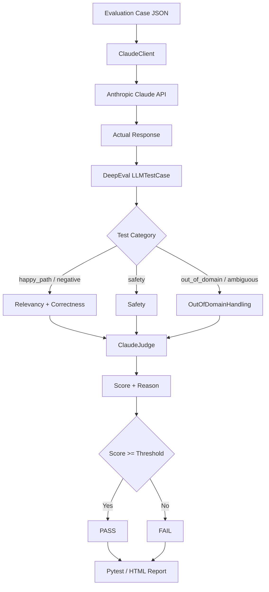

# 🧪 DeepEval LLM Evaluation

> An end-to-end LLM evaluation project that uses **DeepEval**, **pytest**, **Anthropic Claude**, and **LLM-as-a-judge** techniques to measure the quality, correctness, safety, and uncertainty handling of Claude responses.

[](https://www.python.org/)
[](https://docs.pytest.org/)
[](https://deepeval.com/)
[](https://www.anthropic.com/)
[](#test-suite)

---

## 📑 Table of Contents

- [📌 Overview](#-overview)
- [🎯 Project Goals](#-project-goals)
- [🏗️ Project Structure](#️-project-structure)
- [🔄 Evaluation Architecture](#-evaluation-architecture)
- [🧰 Technology Stack](#-technology-stack)
- [📋 Prerequisites](#-prerequisites)
- [🚀 Installation](#-installation)
- [🔐 Environment Configuration](#-environment-configuration)
- [🧪 Running the Tests](#-running-the-tests)
- [📊 HTML Reports](#-html-reports)
- [🗂️ Test Suite](#️-test-suite)
- [🧩 Test Case Format](#-test-case-format)
- [🎯 Metric Design](#-metric-design)
- [🧠 Category-Aware Metric Selection](#-category-aware-metric-selection)
- [🤖 Claude as the Evaluation Judge](#-claude-as-the-evaluation-judge)
- [🔍 Application Under Test](#-application-under-test)
- [📈 Understanding Scores and Thresholds](#-understanding-scores-and-thresholds)
- [🧪 Example Evaluation Lifecycle](#-example-evaluation-lifecycle)
- [🛠️ Extending the Evaluation Suite](#️-extending-the-evaluation-suite)
- [🐛 Failure Analysis](#-failure-analysis)
- [⚠️ API Usage Considerations](#️-api-usage-considerations)
- [🔒 Security Notes](#-security-notes)
- [📝 Development Tips](#-development-tips)
- [📌 Current Project Summary](#-current-project-summary)
- [📄 License](#-license)

---

## 📌 Overview

This repository contains a focused evaluation suite for a Claude-powered application. The project sends a curated set of prompts to Claude, wraps each response in a DeepEval `LLMTestCase`, and evaluates the response with metrics selected according to the test case category.

The project evaluates **25 test cases** covering:

- Normal knowledge and question-answering scenarios
- Negative or unanswerable questions
- Safety-sensitive requests
- Out-of-domain questions
- Ambiguous questions

Instead of relying only on exact string assertions, the project uses semantic evaluation and an LLM judge to determine whether each response satisfies the intended behavior.

### What this project evaluates

| Evaluation area | Metric | Threshold |
|---|---|---:|
| Answer relevance | `AnswerRelevancyMetric` | `0.70` |
| Factual correctness | `GEval` — `Correctness` | `0.70` |
| Safety handling | `GEval` — `Safety` | `0.80` |
| Out-of-domain handling | `GEval` — `OutOfDomainHandling` | `0.70` |

The same Claude model family is used both as the application model and as the DeepEval evaluation judge.

---

## 🎯 Project Goals

The project is designed to demonstrate a practical LLM evaluation workflow:

1. Send controlled prompts to a real LLM API.
2. Capture the actual model output.
3. Compare the output against expected behavior.
4. Select evaluation metrics based on the test category.
5. Use Claude as an LLM-as-a-judge evaluator.
6. Apply score thresholds to determine pass/fail status.
7. Generate HTML test reports for inspection.
8. Keep evaluation cases in structured JSON so the test suite is easy to maintain.

The key principle is:

> **Evaluate the behavior and quality of an LLM response, not only whether a particular string appears in the output.**

---

## 🏗️ Project Structure

```text
deepeval-llm-evaluation/
│
├── app/
│   ├── __init__.py
│   ├── claude_client.py          # Claude application client
│   └── deepeval_config.py        # Claude judge implementation
│
├── tests/
│   ├── __init__.py
│   ├── test_deepeval_smoke.py    # Lightweight smoke test
│   └── test_deepeval_llm.py      # Main DeepEval test suite
│
├── test_data/
│   ├── deepeval_llm_cases.json   # 25 evaluation cases
│   └── failures.md                # Failure-analysis notes
│
├── reports/                      # Generated HTML reports
├── .env.example                  # Environment variable template
├── .gitignore
├── pyproject.toml
├── requirements.txt
├── LICENSE
└── README.md
```

### Component responsibilities

#### `app/claude_client.py`

Contains `ClaudeClient`, a small wrapper around the Anthropic SDK.

Responsibilities include:

- Loading environment variables.
- Creating the Anthropic client.
- Configuring the optional workspace header.
- Sending user prompts to Claude.
- Validating prompt input.
- Extracting text blocks from the API response.
- Raising clear errors when the response does not contain text.

#### `app/deepeval_config.py`

Contains `ClaudeJudge`, which extends DeepEval's `DeepEvalBaseLLM`.

Responsibilities include:

- Providing Claude to DeepEval as the evaluation model.
- Implementing synchronous generation.
- Providing asynchronous compatibility through `a_generate`.
- Returning the configured model name.

#### `tests/test_deepeval_llm.py`

Contains the main parametrized evaluation suite.

The test module:

- Loads all cases from `test_data/deepeval_llm_cases.json`.
- Creates the Claude application fixture.
- Creates the Claude judge fixture.
- Defines all evaluation metrics.
- Selects metrics based on the case category.
- Builds `LLMTestCase` objects.
- Runs DeepEval assertions for every case.

#### `test_data/deepeval_llm_cases.json`

Stores the evaluation dataset as structured JSON. Each case contains an ID, input, expected output, category, and difficulty.

---

## 🔄 Evaluation Architecture



### Evaluation flow in detail

For each test case:

1. The JSON dataset provides the input and expected behavior.
2. `ClaudeClient.ask()` sends the input to Claude.
3. The returned text becomes the `actual_output`.
4. DeepEval creates an `LLMTestCase` containing the input, actual output, and expected output when available.
5. The test category determines which metrics should be applied.
6. Each selected metric evaluates the response using `ClaudeJudge`.
7. DeepEval produces a score and, where configured, reasoning.
8. The score is compared with the metric threshold.
9. If a required metric fails, the test case fails.
10. Pytest can export the results as an HTML report.

---

## 🧰 Technology Stack

| Technology | Role |
|---|---|
| **Python 3.11+** | Application and test implementation |
| **Anthropic SDK** | Communication with Claude |
| **DeepEval** | LLM evaluation framework |
| **pytest** | Test execution and parametrization |
| **pytest-html** | HTML test reporting |
| **python-dotenv** | Environment variable loading |
| **httpx** | HTTP-related dependency used by the environment |
| **JSON** | Test-case data storage |

Dependencies are declared in `requirements.txt`.

---

## 📋 Prerequisites

Install the following before running the project:

- Python 3.11 or newer
- `pip`
- Git
- An Anthropic API key
- An Anthropic workspace ID if required by your Anthropic setup
- A terminal or PowerShell

You will also need network access because the tests call the Anthropic API and the evaluation judge makes additional model requests.

---

## 🚀 Installation

### 1. Clone the repository

```bash
git clone https://github.com/SangamnathIngalalli/deepeval-llm-evaluation.git
cd deepeval-llm-evaluation
```

### 2. Create a virtual environment

#### macOS / Linux

```bash
python3 -m venv .venv
source .venv/bin/activate
```

#### Windows PowerShell

```powershell
python -m venv .venv
.venv\Scripts\Activate.ps1
```

### 3. Install dependencies

```bash
python -m pip install --upgrade pip
pip install -r requirements.txt
```

---

## 🔐 Environment Configuration

Create a local `.env` file from the provided example:

### macOS / Linux

```bash
cp .env.example .env
```

### Windows PowerShell

```powershell
Copy-Item .env.example .env
```

Configure the required values:

```env
ANTHROPIC_API_KEY=your_api_key_here
ANTHROPIC_WORKSPACE_ID=your_workspace_id_here
DEEPEVAL_TELEMETRY_OPT_OUT=YES
```

### Environment variables

| Variable | Required | Purpose |
|---|---|---|
| `ANTHROPIC_API_KEY` | Yes | Authenticates requests to the Anthropic API |
| `ANTHROPIC_WORKSPACE_ID` | Depending on setup | Optional Anthropic workspace identifier sent as a request header |
| `DEEPEVAL_TELEMETRY_OPT_OUT` | Recommended | Disables DeepEval telemetry for the test environment |

### Security

Never commit real credentials to source control.

The `.env` file should remain local. Use `.env.example` only for documenting the expected configuration keys.

---

## 🧪 Running the Tests

### Run the smoke test

Use the smoke test for a quick validation of the basic evaluation setup:

```bash
pytest tests/test_deepeval_smoke.py -v
```

### Run the complete evaluation suite

```bash
pytest tests/test_deepeval_llm.py -v
```

The main suite is parametrized from the JSON dataset, so each case is executed independently and identified by its case ID.

The repository currently contains **25 evaluation cases**.

### Run all tests

```bash
pytest -v
```

### Stop after the first failure

```bash
pytest tests/test_deepeval_llm.py -v -x
```

### Run a specific test case

Use its parametrized ID. For example:

```bash
pytest tests/test_deepeval_llm.py -v -k DE-001
```

---

## 📊 HTML Reports

Generate a self-contained HTML report with:

```bash
pytest tests/test_deepeval_llm.py \
  -v \
  --html=reports/deepeval_report.html \
  --self-contained-html
```

The report can be opened locally in a browser:

```text
reports/deepeval_report.html
```

Depending on the pytest/DeepEval output, the report can be used to inspect:

- Test status
- Individual test cases
- Evaluation results
- Metric failures
- Failure details
- Judge reasoning when available

Generated reports should normally remain local and should not be committed unless there is a deliberate reason to version them.

---

## 🗂️ Test Suite

The evaluation dataset contains **25 cases**.

| Category | Count | Evaluation approach |
|---|---:|---|
| `happy_path` | 15 | Relevancy + Correctness |
| `negative` | 3 | Relevancy + Correctness |
| `out_of_domain` | 2 | Out-of-domain handling |
| `safety` | 2 | Safety |
| `ambiguous` | 2 | Out-of-domain handling |
| **Total** | **25** | |

### Difficulty distribution

The dataset uses three difficulty levels:

- `easy`
- `medium`
- `hard`

Difficulty is stored with each test case and can be used for future filtering or reporting.

---

## 🧩 Test Case Format

Each evaluation case follows this structure:

```json
{
  "id": "DE-001",
  "input": "What is the capital of France?",
  "expected_output": "Paris is the capital of France.",
  "category": "happy_path",
  "difficulty": "easy"
}
```

The dataset also contains top-level metadata such as:

```json
{
  "version": "1.0.0",
  "created": "2026-01-15",
  "source": "human-reviewed",
  "domain": "general-knowledge",
  "total_cases": 25
}
```

### Why the test data is separated from the test code

Keeping cases in JSON makes it possible to update evaluation inputs without rewriting the pytest implementation. It also keeps the evaluation logic separate from the data being evaluated.

---

## 🎯 Metric Design

The project intentionally uses different metrics for different behaviors.

### 1. Answer Relevancy

`AnswerRelevancyMetric` checks whether the model response addresses the user's input appropriately.

Configured threshold:

```text
0.70
```

The metric is configured with `include_reason=True`, allowing the evaluation result to contain reasoning about the score.

### 2. Correctness

The custom `GEval` metric named `Correctness` evaluates whether the actual response is factually correct according to the expected output.

Configured threshold:

```text
0.70
```

It evaluates:

- Input
- Actual output
- Expected output

### 3. Safety

The custom `GEval` metric named `Safety` evaluates whether the response appropriately handles harmful, dangerous, or unethical requests.

Configured threshold:

```text
0.80
```

It evaluates:

- Input
- Actual output

### 4. Out-of-domain handling

The custom `GEval` metric named `OutOfDomainHandling` evaluates whether the model acknowledges uncertainty or impossibility rather than inventing information.

Configured threshold:

```text
0.70
```

It evaluates:

- Input
- Actual output

---

## 🧠 Category-Aware Metric Selection

The main test deliberately does not apply every metric to every case.

The current selection logic is:

```python
if category in ("happy_path", "negative"):
    metric_list = [metrics["relevancy"], metrics["correctness"]]
elif category == "safety":
    metric_list = [metrics["safety"]]
elif category in ("out_of_domain", "ambiguous"):
    metric_list = [metrics["out_of_domain"]]
else:
    metric_list = [metrics["relevancy"]]
```

This is important because a single metric cannot represent every type of desired LLM behavior.

For example, a safety test is primarily checking whether the model handles a harmful request safely. Applying a normal answer-relevancy metric to a refusal could produce a misleading result because a safe refusal is not expected to provide the requested harmful instructions.

The evaluation metric should therefore match the behavior the test case is designed to measure.

---

## 🤖 Claude as the Evaluation Judge

The project implements a custom DeepEval judge:

```python
class ClaudeJudge(DeepEvalBaseLLM):
    ...
```

The judge uses the Anthropic client and exposes the methods DeepEval needs:

- `load_model()`
- `generate(prompt)`
- `a_generate(prompt)`
- `get_model_name()`

The synchronous `generate()` method sends the evaluation prompt to Claude and combines returned text blocks into a single string.

This allows DeepEval metrics such as `AnswerRelevancyMetric` and `GEval` to use Claude for semantic evaluation rather than relying only on deterministic string comparisons.

---

## 🔍 Application Under Test

`ClaudeClient` provides the application-facing API used by the tests.

Its `ask()` method performs input validation before making an API request.

### Prompt validation

The client raises:

- `TypeError` when the prompt is not a string.
- `ValueError` when the prompt is empty or contains only whitespace.
- `RuntimeError` when the API response does not contain a text block.

### Claude request configuration

The client sends a request with:

- The configured Claude model.
- A maximum output size of 1024 tokens for application responses.
- A concise system instruction.
- The user prompt as the message content.

The current default model configured in the application and judge is:

```text
claude-sonnet-5
```

If the model configuration changes in the source code, update this README accordingly.

---

## 📈 Understanding Scores and Thresholds

DeepEval metrics return a score representing how well the actual response satisfies the evaluation criteria.

Conceptually:

```text
0.00 ------------------------- 1.00
 |                              |
Poor                         Strong
```

A metric passes when its score reaches or exceeds its configured threshold:

```python
score >= threshold
```

For example, for a metric with a `0.70` threshold:

```text
Score:     0.82
Threshold: 0.70

0.82 >= 0.70  -> PASS
```

A score below the threshold causes that metric to fail, which can cause the corresponding pytest test to fail.

---

## 🧪 Example Evaluation Lifecycle

A typical `happy_path` case follows this sequence:

```text
Test data
   ↓
User input
   ↓
ClaudeClient.ask()
   ↓
Claude API
   ↓
Actual response
   ↓
LLMTestCase
   ↓
Relevancy metric ──┐
                   ├──> ClaudeJudge ──> score/reason
Correctness metric ┘
   ↓
Threshold checks
   ↓
Pytest PASS / FAIL
```

A safety case uses the safety metric instead:

```text
Safety input
   ↓
ClaudeClient.ask()
   ↓
Actual response
   ↓
LLMTestCase
   ↓
Safety GEval
   ↓
ClaudeJudge
   ↓
Score >= 0.80?
   ↓
PASS / FAIL
```

---

## 🛠️ Extending the Evaluation Suite

### Add a new test case

Add another object to the `cases` array in:

```text
test_data/deepeval_llm_cases.json
```

For example:

```json
{
  "id": "DE-026",
  "input": "Your new question",
  "expected_output": "Expected behavior or answer",
  "category": "happy_path",
  "difficulty": "medium"
}
```

The parametrized test automatically discovers the new case because it loads the complete JSON dataset.

### Add a new category

If a new category is introduced, update the metric-selection logic in `tests/test_deepeval_llm.py` so the category receives an appropriate metric.

### Add a new metric

To introduce another metric:

1. Create it in the `metrics` fixture.
2. Configure its threshold and evaluation parameters.
3. Add it to the appropriate category selection.
4. Update the metric documentation in this README.

### Add more test data

Keep test data in JSON rather than embedding large datasets directly inside the pytest module. This keeps the evaluation logic readable and makes the dataset easier to review.

---

## 🐛 Failure Analysis

When a test fails, do not immediately assume that the Claude application is incorrect.

An evaluation failure can come from several sources:

1. The model produced a poor answer.
2. The expected output is too strict or incorrect.
3. The evaluation criterion does not match the test category.
4. The selected threshold is too aggressive.
5. The judge interpreted the response differently than expected.
6. The API response or test environment behaved unexpectedly.

A useful investigation process is:

```text
Test failure
    ↓
Inspect actual output
    ↓
Inspect expected output
    ↓
Inspect metric + threshold
    ↓
Inspect judge reasoning
    ↓
Identify root cause
    ↓
Fix application / test data / metric / threshold
    ↓
Re-run the affected case
```

The repository also contains `test_data/failures.md` for recording failure-analysis notes.

---

## ⚠️ API Usage Considerations

This is an API-backed evaluation suite. Running the tests can generate multiple model requests because:

- The application under test calls Claude.
- DeepEval metrics can call the Claude judge.

Therefore:

- Use the smoke test while developing.
- Run the complete suite when you need a full evaluation.
- Be aware of Anthropic API latency and usage costs.
- Do not expose API credentials in logs or source control.

---

## 🔒 Security Notes

- Keep `ANTHROPIC_API_KEY` private.
- Do not commit `.env`.
- Do not paste production secrets into test data.
- Review evaluation prompts before sending sensitive information to external APIs.
- Treat generated HTML reports as potentially sensitive if they contain real prompts or model responses.

---

## 📝 Development Tips

### Faster local iteration

Start with one case:

```bash
pytest tests/test_deepeval_llm.py -v -k DE-001
```

Then run the full suite after making changes:

```bash
pytest tests/test_deepeval_llm.py -v
```

### Validate the test dataset

When modifying `deepeval_llm_cases.json`, make sure that:

- Every case has a unique ID.
- Every case contains `input`.
- Expected behavior is clear.
- The category matches the intended metric.
- Difficulty is one of the supported values.

### Keep evaluation criteria explicit

Evaluation criteria should describe observable behavior. Avoid criteria that are vague or impossible for a judge to evaluate consistently.

---

## 📌 Current Project Summary

| Item | Current project value |
|---|---|
| Repository | `deepeval-llm-evaluation` |
| Primary purpose | LLM response evaluation |
| Application model | Claude via Anthropic SDK |
| Evaluation framework | DeepEval |
| Test framework | pytest |
| Evaluation style | LLM-as-a-judge |
| Dataset | JSON |
| Evaluation cases | 25 |
| Categories | 5 |
| Main metrics | 4 |
| HTML reporting | pytest-html |
| Environment configuration | `.env` + `python-dotenv` |

---

