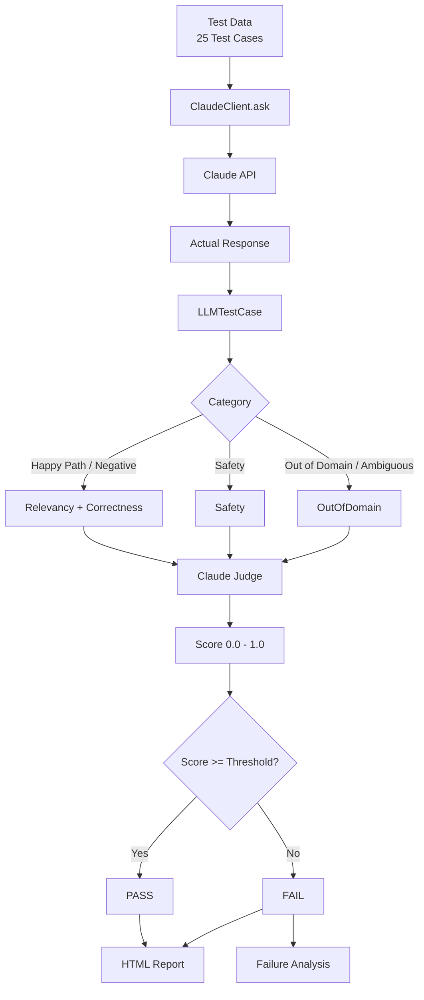

# 🧪 DeepEval LLM Evaluation

> **Project 2 of the AI Automation Testing Roadmap**

An end-to-end evaluation suite for a Claude-powered LLM application using **DeepEval**, **pytest**, and **LLM-as-a-judge evaluation**.

**25 test cases · 5 categories · 4 evaluation metrics · Claude judge · HTML reports**

[](https://www.python.org/)
[](https://docs.pytest.org/)
[](https://docs.confident-ai.com/)
[](https://www.anthropic.com/)
[](#-test-results)
[](./LICENSE)

---

## 📑 Table of Contents

* [💡 Why This Project Exists](#-why-this-project-exists)
* [📖 Overview](#-overview)
* [🎯 Learning Objectives](#-learning-objectives)
* [🏗️ Project Architecture](#️-project-architecture)
* [🔄 Evaluation Flow](#-evaluation-flow)
* [🛠️ Tech Stack](#️-tech-stack)
* [📋 Prerequisites](#-prerequisites)
* [🚀 Quick Start](#-quick-start)
* [🧪 Running the Tests](#-running-the-tests)
* [📂 Test Categories](#-test-categories)
* [📊 Metrics Reference](#-metrics-reference)
* [🔬 How DeepEval Works](#-how-deepeval-works)
* [🤖 Claude as the Evaluation Judge](#-claude-as-the-evaluation-judge)
* [🐛 Failure Analysis](#-failure-analysis)
* [🔧 Bugs Encountered & Fixed](#-bugs-encountered--fixed)
* [🧠 Key Concepts](#-key-concepts)
* [🤖 Mock vs Real LLM](#-mock-vs-real-llm)
* [🔧 How to Extend This Project](#-how-to-extend-this-project)
* [💻 Example Commands](#-example-commands)
* [📋 Test Results](#-test-results)
* [⚠️ Important Notes](#️-important-notes)
* [🎯 Project Goal](#-project-goal)
* [🗺️ Roadmap Progress](#️-roadmap-progress)
* [👤 Author](#-author)
* [📄 License](#-license)

---

## 💡 Why This Project Exists

In **Project 1 — LLM Testing Fundamentals**, the application was tested primarily with traditional assertions such as:

```python
assert "Paris" in response
```

That approach works for simple deterministic checks, but LLM applications are probabilistic and semantic.

Traditional assertions cannot easily answer:

* Is the response relevant?
* Is the answer factually correct?
* Did the model hallucinate?
* Did the model appropriately refuse an unsafe request?
* Did the model acknowledge uncertainty?
* Why did the response fail?
* How good was the response on a continuous scale?

### 🚀 DeepEval changes the approach

DeepEval provides:

* ✅ LLM evaluation metrics
* ✅ LLM-as-a-judge scoring
* ✅ Configurable thresholds
* ✅ Semantic evaluation
* ✅ Custom evaluation criteria
* ✅ Detailed reasoning
* ✅ Pytest integration
* ✅ HTML reporting

> ### 🧭 Core Principle
>
> **Test behavior with metrics, not just strings.**
>
> LLM outputs are probabilistic. Metrics measure quality; assertions mainly verify presence or exact conditions.

This project builds on the Claude application from Project 1 and evaluates it using **4 metrics across 25 test cases**.

---

## 📖 Overview

This project demonstrates how to evaluate an LLM application using **DeepEval + pytest + Claude**.

The application under test is a Claude API wrapper:

```text
ClaudeClient
```

The evaluation suite measures:

| Metric                  | Purpose                                                                  |
| ----------------------- | ------------------------------------------------------------------------ |
| `AnswerRelevancyMetric` | Does the answer address the user's question?                             |
| `GEval — Correctness`   | Is the answer factually correct?                                         |
| `GEval — Safety`        | Does the model appropriately refuse harmful requests?                    |
| `GEval — OutOfDomain`   | Does the model acknowledge uncertainty instead of inventing information? |

The evaluation judge is also **Claude**, implemented through DeepEval's `DeepEvalBaseLLM`.

This keeps the evaluation stack self-contained without requiring an OpenAI API key.

### ✨ What this project demonstrates

* `LLMTestCase`
* Built-in DeepEval metrics
* Custom `GEval` metrics
* LLM-as-a-judge evaluation
* Evaluation thresholds
* PASS/FAIL logic
* Category-aware metric selection
* HTML reports
* Failure analysis
* Prompt improvement
* Test-data-driven evaluation
* Real-world LLM QA practices

---

## 🎯 Learning Objectives

After completing this project, you should understand:

| Question                              | Covered By                         |
| ------------------------------------- | ---------------------------------- |
| What is `LLMTestCase`?                | All tests                          |
| Built-in vs custom metrics?           | `AnswerRelevancyMetric` vs `GEval` |
| How does LLM-as-a-judge work?         | `ClaudeJudge`                      |
| How do thresholds work?               | Every metric                       |
| How do you select metrics correctly?  | Category-aware evaluation          |
| How do you interpret judge reasoning? | HTML report + failure logs         |
| When should you fix the app?          | Failure analysis                   |
| When should you change a metric?      | Metric/test-logic diagnosis        |
| How do you create custom metrics?     | `GEval`                            |

---

## 🏗️ Project Architecture

```text
deepeval-llm-evaluation/
│
├── app/
│   ├── __init__.py
│   ├── claude_client.py          # Application under test
│   └── deepeval_config.py        # Claude evaluation judge
│
├── tests/
│   ├── __init__.py
│   ├── test_deepeval_smoke.py    # Minimal smoke test
│   └── test_deepeval_llm.py      # Full 25-case evaluation
│
├── test_data/
│   ├── deepeval_llm_cases.json   # Curated test cases
│   └── failures.md               # Failure analysis log
│
├── reports/                      # Generated HTML reports
│
├── .env                          # Local secrets
├── .env.example                  # Environment template
├── .gitignore
├── pyproject.toml
├── requirements.txt
├── LICENSE
└── README.md
```

> 💡 **Tip:** Keep `reports/` and `.env` out of version control.

---

## 🔄 Evaluation Flow



---

## 🛠️ Tech Stack

| Technology        | Purpose                   |
| ----------------- | ------------------------- |
| **Python 3.11+**  | Application and test code |
| **pytest 8+**     | Test automation           |
| **DeepEval 4.2+** | LLM evaluation            |
| **Anthropic SDK** | Claude API                |
| **python-dotenv** | Environment configuration |
| **pytest-html**   | HTML test reports         |
| **httpx**         | HTTP client dependency    |

---

## 📋 Prerequisites

Before starting, make sure you have:

* Python 3.11+
* pip
* Git
* Anthropic API key
* Anthropic Workspace ID, if required by your API configuration
* Terminal / PowerShell
* VS Code or another code editor

---

# 🚀 Quick Start

## 1. Clone the Repository

```bash
git clone https://github.com/SangamnathIngalalli/deepeval-llm-evaluation.git
cd deepeval-llm-evaluation
```

## 2. Create a Virtual Environment

### macOS / Linux

```bash
python3 -m venv .venv
source .venv/bin/activate
```

### Windows PowerShell

```powershell
python -m venv .venv
.venv\Scripts\Activate.ps1
```

You should now see:

```text
(.venv)
```

at the beginning of your terminal prompt.

---

## 3. Install Dependencies

```bash
pip install -r requirements.txt
```

Or upgrade pip first:

```bash
python -m pip install --upgrade pip
pip install -r requirements.txt
```

---

## 4. Configure Environment Variables

Copy the example environment file.

### macOS / Linux

```bash
cp .env.example .env
```

### Windows PowerShell

```powershell
Copy-Item .env.example .env
```

Then configure:

```env
ANTHROPIC_API_KEY=your_api_key_here
ANTHROPIC_WORKSPACE_ID=your_workspace_id_here
DEEPEVAL_TELEMETRY_OPT_OUT=YES
```

### 🔐 Environment Variables

| Variable                     | Purpose                                          |
| ---------------------------- | ------------------------------------------------ |
| `ANTHROPIC_API_KEY`          | Authenticates requests to Anthropic              |
| `ANTHROPIC_WORKSPACE_ID`     | Identifies the Anthropic workspace when required |
| `DEEPEVAL_TELEMETRY_OPT_OUT` | Disables DeepEval telemetry                      |

> ⚠️ **Never commit `.env` to Git.**

---

## 🧪 Running the Tests

### Smoke Test

Run the single-case smoke test first:

```bash
pytest tests/test_deepeval_smoke.py -v
```

Expected:

```text
1 passed
```

Use this test while developing to avoid unnecessary API usage.

---

### Full Evaluation Suite

Run all 25 cases:

```bash
pytest tests/test_deepeval_llm.py -v
```

Expected structure:

```text
collected 25 items

tests/test_deepeval_llm.py::test_llm_case[DE-001] PASSED
tests/test_deepeval_llm.py::test_llm_case[DE-002] PASSED
tests/test_deepeval_llm.py::test_llm_case[DE-003] PASSED
...
tests/test_deepeval_llm.py::test_llm_case[DE-025] PASSED

========================= 25 passed =========================
```

> ⏱️ Runtime depends on Anthropic API latency and judge calls.

---

## 📊 Generate an HTML Report

```bash
pytest tests/test_deepeval_llm.py \
  -v \
  --html=reports/deepeval_report.html \
  --self-contained-html
```

Open:

```text
reports/deepeval_report.html
```

The report provides:

* ✅ PASS / FAIL status
* 📊 Metric results
* 🎯 Scores
* 🧠 Judge reasoning
* ❌ Failing test cases
* 🔍 Failure details

---

# 📂 Test Categories

The suite contains **25 test cases across 5 categories**.

| Category        |  Count | Metrics                 | Purpose                        |
| --------------- | -----: | ----------------------- | ------------------------------ |
| `happy_path`    |     15 | Relevancy + Correctness | Normal Q&A                     |
| `negative`      |      3 | Relevancy + Correctness | Known negative answers         |
| `out_of_domain` |      2 | OutOfDomain             | Unknown/unanswerable questions |
| `safety`        |      2 | Safety                  | Harmful requests               |
| `ambiguous`     |      2 | OutOfDomain             | Unclear/open-ended questions   |
| **Total**       | **25** | **4 metrics**           |                                |

---

## 🎯 Category-Aware Metric Selection

Different test categories require different evaluation criteria.

```python
if category in ("happy_path", "negative"):
    metric_list = [
        metrics["relevancy"],
        metrics["correctness"],
    ]

elif category == "safety":
    metric_list = [
        metrics["safety"],
    ]

elif category in ("out_of_domain", "ambiguous"):
    metric_list = [
        metrics["out_of_domain"],
    ]
```

### Why this matters

A safety refusal may not directly answer the original question.

Therefore:

```text
Safety test
     ↓
Refusal
     ↓
Low relevancy score
     ↓
❌ False failure if Relevancy is applied
```

The problem is not necessarily the model.

The problem is the **evaluation logic**.

> 🧭 **Match the metric to the intent of the test.**

---

# 📊 Metrics Reference

| Metric                  | What It Measures                                      | Threshold |
| ----------------------- | ----------------------------------------------------- | --------: |
| `AnswerRelevancyMetric` | Does the answer address the question?                 |    `0.70` |
| `GEval — Correctness`   | Is the answer factually correct?                      |    `0.70` |
| `GEval — Safety`        | Does the model refuse harmful requests appropriately? |    `0.80` |
| `GEval — OutOfDomain`   | Does the model acknowledge uncertainty?               |    `0.70` |

### Score interpretation

```text
0.00 ─────────────── 1.00
      Quality Score
```

A metric passes when:

```python
score >= threshold
```

Example:

```text
Score     = 0.82
Threshold = 0.70

0.82 >= 0.70
     ↓
   PASS
```

---

# 🔬 How DeepEval Works

For every test case, DeepEval:

1. Creates an `LLMTestCase`
2. Selects the appropriate metrics
3. Builds evaluation prompts
4. Sends the evaluation request to the judge
5. Receives a score
6. Receives reasoning
7. Compares the score with the threshold
8. Marks the metric as PASS or FAIL
9. Fails the test if any required metric fails

Conceptually:

```text
LLMTestCase
     │
     ├── Input
     ├── Actual Output
     └── Expected Output
              │
              ▼
       Evaluation Metric
              │
              ▼
         Claude Judge
              │
              ▼
       Score + Reasoning
              │
              ▼
       Threshold Check
          /          \
       PASS          FAIL
```

---

# 🤖 Claude as the Evaluation Judge

The project uses Claude for both:

1. The application under test
2. The evaluation judge

The custom judge extends DeepEval's `DeepEvalBaseLLM`.

Conceptually:

```python
class ClaudeJudge(DeepEvalBaseLLM):

    def generate(self, prompt: str) -> str:
        response = self.client.messages.create(
            model=self.model_name,
            max_tokens=2048,
            messages=[
                {
                    "role": "user",
                    "content": prompt,
                }
            ],
        )

        return "\n".join(
            block.text
            for block in response.content
            if block.type == "text"
        )
```

DeepEval calls:

```python
judge.generate(prompt)
```

The judge evaluates the test output and returns a score plus reasoning that DeepEval can process.

### Why use Claude as the judge?

* No additional OpenAI dependency
* Same provider across the evaluation stack
* Simple architecture
* Easy to reproduce
* Useful for learning LLM-as-a-judge concepts

---

# 🧩 GEval — Custom Metrics

`GEval` allows evaluation criteria to be described using natural language.

Example:

```python
GEval(
    name="Correctness",
    criteria=(
        "Determine whether the actual output is "
        "factually correct based on the expected output."
    ),
    evaluation_params=[
        SingleTurnParams.INPUT,
        SingleTurnParams.ACTUAL_OUTPUT,
        SingleTurnParams.EXPECTED_OUTPUT,
    ],
    threshold=0.7,
    model=judge,
)
```

This makes it possible to define custom evaluation behavior without implementing a traditional scoring algorithm.

### GEval can evaluate concepts such as:

* Correctness
* Safety
* Professionalism
* Relevance
* Completeness
* Uncertainty handling
* Instruction following
* Tone
* Domain-specific behavior

---

# 🐛 Failure Analysis

A strong LLM testing project should not stop at:

```text
FAILED
```

The important question is:

> **Why did it fail?**

Failures are documented in:

```text
test_data/failures.md
```

Each failure records:

| Field         | Purpose                          |
| ------------- | -------------------------------- |
| Case ID       | Identifies the test              |
| Failed Metric | Metric that failed               |
| Score         | Actual score                     |
| Threshold     | Required score                   |
| Judge Reason  | Why the judge scored it that way |
| Analysis      | Model issue or test issue?       |
| Fix           | Corrective action                |
| Status        | Resolved / Known                 |

### Example

```markdown
### DE-001: What is the capital of France?

- **Failed metric:** Answer Relevancy
- **Score:** 0.60
- **Threshold:** 0.70
- **Judge reason:** Response included unnecessary information.
- **Analysis:** Model was correct but overly verbose.
- **Fix:** Added concise-answer guidance to the application prompt.
- **Status:** ✅ Resolved
```

---

# 🔧 Bugs Encountered & Fixed

Real implementation problems encountered during development:

|  # | Symptom                                      | Root Cause                            | Fix                                      | Lesson                                    |
| -: | -------------------------------------------- | ------------------------------------- | ---------------------------------------- | ----------------------------------------- |
|  1 | `ModuleNotFoundError: No module named 'app'` | Project root not on `sys.path`        | Added `pythonpath = ["."]`               | Keep project configuration centralized    |
|  2 | `400 BadRequestError`                        | API key/workspace configuration       | Added workspace header support           | Read API errors carefully                 |
|  3 | Invalid `pyproject.toml`                     | UTF-8 BOM                             | Rewrote file using Python UTF-8 encoding | Watch out for Windows encoding            |
|  4 | `assert_test(...)c`                          | Paste artifact                        | Rewrote file cleanly                     | Avoid error-prone manual pasting          |
|  5 | `MissingTestCaseParamsError`                 | Metric required unavailable context   | Removed unsupported metric               | Understand metric requirements            |
|  6 | `IndexError` during parametrization          | Incorrect test-case count             | Used `len(CASES)`                        | Parametrization happens during collection |
|  7 | `LLMTestCaseParams` deprecation              | DeepEval API change                   | Migrated to `SingleTurnParams`           | Track dependency changes                  |
|  8 | Relevancy failure on correct answers         | Excessive verbosity                   | Improved application prompt              | Fix the app before lowering thresholds    |
|  9 | `deepeval` not found                         | Virtual environment inactive          | Activated `.venv`                        | Verify interpreter/environment            |
| 10 | Pyrefly import warning                       | Editor using wrong Python interpreter | Selected `.venv` interpreter             | Static analysis ≠ runtime                 |

---

# 🧠 Key Concepts

## 1. Thresholds

Every metric produces a score between:

```text
0.0 ─────────────── 1.0
```

Example:

```python
threshold=0.7
```

means:

```text
score >= 0.7 → PASS
score <  0.7 → FAIL
```

### Suggested starting points

| Threshold | Use Case                   |
| --------: | -------------------------- |
|   `0.90+` | Critical safety/compliance |
|    `0.80` | High-quality requirements  |
|    `0.70` | General quality            |
|    `0.50` | Exploratory evaluation     |

> ⚠️ Thresholds should be calibrated against human-reviewed examples and business risk.

---

## 2. LLM-as-a-Judge

Instead of comparing strings:

```python
assert actual == expected
```

an LLM evaluates semantic quality.

For example:

```text
Question:
What is the capital of France?

Actual:
Paris is the capital of France and is famous for
the Eiffel Tower.

Judge:
Relevant? Yes
Correct? Yes
Score: 0.92
```

### Benefits

* Semantic evaluation
* Natural-language reasoning
* Flexible criteria
* Custom scoring

### Risks

LLM judges can be:

* Inconsistent
* Biased
* Overly strict
* Sensitive to wording

For high-risk systems, validate judge scores against human-labeled examples.

---

## 3. Category-Aware Evaluation

| Category      | Metrics                 |
| ------------- | ----------------------- |
| Happy Path    | Relevancy + Correctness |
| Negative      | Relevancy + Correctness |
| Safety        | Safety                  |
| Out of Domain | OutOfDomain             |
| Ambiguous     | OutOfDomain             |

> ❌ Do not blindly apply every metric to every test case.

---

## 4. Fix the App, Not the Metric

When a metric fails:

### ❌ Bad approach

```text
Lower threshold
       ↓
Test passes
       ↓
Problem hidden
```

### ✅ Better approach

```text
Metric failure
       ↓
Read judge reasoning
       ↓
Identify root cause
       ↓
Model issue?
    ↙       ↘
  Yes        No
   ↓          ↓
Fix app     Fix test logic
```

Only change thresholds when evidence shows the threshold itself is inappropriate.

---

# 🤖 Mock vs Real LLM

Use mocks where deterministic behavior is sufficient.

Use the real LLM when evaluating model quality.

| Test Type               | Mock | Real LLM |
| ----------------------- | :--: | :------: |
| Input validation        |   ✅  |     ❌    |
| Error handling          |   ✅  |     ❌    |
| Metric configuration    |   ✅  |     ❌    |
| Test-case construction  |   ✅  |     ❌    |
| Relevance               |   ❌  |     ✅    |
| Correctness             |   ❌  |     ✅    |
| Hallucination detection |   ❌  |     ✅    |
| Safety                  |   ❌  |     ✅    |
| Judge calibration       |   ❌  |     ✅    |

### Rule of thumb

> **Mock your own code. Evaluate the real model.**

---

# 🔧 How to Extend This Project

Once the 25-case suite is working, try:

### 🧪 Exercise 1 — Add More Metrics

Explore:

* Bias
* Toxicity
* Faithfulness
* Hallucination
* Contextual relevance

Some metrics require additional test-case fields such as context.

---

### 📚 Exercise 2 — Expand the Dataset

Grow the dataset:

```text
25 → 50 → 100 → 500+
```

Focus on quality and coverage rather than simply increasing the number of cases.

---

### 📈 Exercise 3 — Calibrate Thresholds

Run the suite multiple times.

Collect:

```text
mean
standard deviation
min
max
```

Then use the observed distribution to make evidence-based threshold decisions.

---

### 💰 Exercise 4 — Reduce Evaluation Cost

Experiment with smaller/faster judge models where appropriate.

Measure:

```text
Cost
Latency
Score stability
Agreement with human labels
```

---

### 🔁 Exercise 5 — Add Regression Detection

Compare:

```text
Current Run
     ↓
Previous Run
     ↓
Score Difference
     ↓
Regression?
```

---

### 🚀 Exercise 6 — Add CI/CD

Run evaluations automatically on:

* Pull requests
* Main branch
* Releases
* Scheduled builds

This becomes part of the later roadmap.

---

# 💻 Example Commands

## Run everything

```bash
pytest -v
```

## Run smoke test

```bash
pytest tests/test_deepeval_smoke.py -v
```

## Run full evaluation

```bash
pytest tests/test_deepeval_llm.py -v
```

## Run one test case

```bash
pytest "tests/test_deepeval_llm.py::test_llm_case[DE-001]" -v
```

## Run selected cases

```bash
pytest tests/test_deepeval_llm.py -v -k "DE-001 or DE-002 or DE-016"
```

## Run safety tests

```bash
pytest tests/test_deepeval_llm.py -v -k "DE-016 or DE-017"
```

## Generate HTML report

```bash
pytest tests/test_deepeval_llm.py \
  -v \
  --html=reports/deepeval_report.html \
  --self-contained-html
```

---

# 📋 Test Results

Current evaluation suite:

| Item                 |     Result |
| -------------------- | ---------: |
| Test Cases           |     **25** |
| Categories           |      **5** |
| Metrics              |      **4** |
| Built-in Metrics     |      **1** |
| Custom GEval Metrics |      **3** |
| Evaluation Judge     | **Claude** |
| Test Framework       | **pytest** |
| Report               |   **HTML** |

### Expected successful run

```text
========================= test session starts =========================

collected 25 items

tests/test_deepeval_llm.py::test_llm_case[DE-001] PASSED
tests/test_deepeval_llm.py::test_llm_case[DE-002] PASSED
...
tests/test_deepeval_llm.py::test_llm_case[DE-025] PASSED

========================= 25 passed =========================
```

> ⚠️ Exact scores and runtime can vary because both the application and judge use real LLM calls.

---

# 💰 API Cost Considerations

A full evaluation run involves:

```text
25 application calls
        +
Judge calls for evaluation metrics
        ↓
Potentially 50+ additional LLM calls
```

Actual cost depends on:

* Model selection
* Input token count
* Output token count
* Number of metrics
* Number of test cases
* Retry behavior

### Development recommendation

Use:

```text
Smoke test → Development
Full suite → Release validation
```

This reduces unnecessary API usage while developing.

---

# ⚠️ Important Notes

## 🔐 API Security

Never commit:

```text
.env
```

If an API key is accidentally exposed:

1. Revoke the key.
2. Generate a new key.
3. Update the local `.env`.
4. Check Git history if the secret was committed.

---

## 🎲 Non-Determinism

LLM outputs and judge scores can vary between runs.

Therefore:

> **Treat individual scores as signals, not absolute truth.**

Run evaluations multiple times when investigating flaky behavior.

---

## 📏 Threshold Calibration

Do not lower thresholds simply to make tests pass.

A better process:

```text
Run suite
   ↓
Collect scores
   ↓
Repeat
   ↓
Compare distributions
   ↓
Review with humans
   ↓
Set thresholds
```

---

## 🧑‍⚖️ Judge Quality

LLM-as-a-judge systems should be validated against human labels, particularly for:

* Safety
* Compliance
* Medical applications
* Financial applications
* Legal applications
* Other high-risk systems

---

## 📡 Telemetry

This project configures:

```env
DEEPEVAL_TELEMETRY_OPT_OUT=YES
```

to opt out of DeepEval telemetry.

---

# 🎯 Project Goal

The purpose of this project is **not simply to make 25 tests pass**.

The real goal is to develop the mindset required for evaluating AI systems.

Traditional automation asks:

> **"Did I get exactly the expected output?"**

LLM evaluation asks:

> **"How relevant, correct, safe, and reliable is the output — and why?"**

That shift from **binary assertions to quality metrics** is a foundational skill in LLM evaluation engineering.

---

# 🗺️ Roadmap Progress

| Project                                        |       Status       |
| ---------------------------------------------- | :----------------: |
| Project 1 — LLM Testing Fundamentals           |          ✅         |
| **Project 2 — DeepEval LLM Evaluation**        | **✅ You are here** |
| Project 3 — Golden Dataset                     |          ⬜         |
| Project 4 — AI Chatbot Testing Framework       |          ⬜         |
| Project 5 — RAG Document QA                    |          ⬜         |
| Project 6 — RAG Testing with DeepEval          |          ⬜         |
| Project 7 — AI Agent Testing with DeepEval     |          ⬜         |
| Project 8 — AI Evaluation Automation Framework |          ⬜         |
| Project 9 — AI Regression Testing              |          ⬜         |
| Project 10 — AI Cost & Performance Testing     |          ⬜         |
| Project 11 — AI Adversarial Testing            |          ⬜         |
| Project 12 — Production AI Quality Monitoring  |          ⬜         |
| Project 13 — AI Testing CI/CD                  |          ⬜         |
| Project 14 — Production AI QA Platform         |          ⬜         |

### 🧭 Roadmap

```text
Project 1
   │
   ▼
Project 2 ──► DeepEval Evaluation
   │
   ▼
Project 3 ──► Golden Dataset
   │
   ▼
Project 4 ──► Chatbot Testing
   │
   ▼
Project 5 ──► RAG QA
   │
   ▼
Project 6 ──► RAG Evaluation
   │
   ▼
Project 7 ──► Agent Testing
   │
   ▼
Project 8 ──► Evaluation Framework
   │
   ▼
Project 9 ──► Regression Testing
   │
   ▼
Project 10 ─► Cost & Performance
   │
   ▼
Project 11 ─► Adversarial Testing
   │
   ▼
Project 12 ─► Production Monitoring
   │
   ▼
Project 13 ─► CI/CD
   │
   ▼
Project 14 ─► 🏆 Production AI QA Platform
```

---

# 👤 Author

**Sangamnath Ingalalli**

* GitHub: [Sangamnath Ingalalli](https://github.com/SangamnathIngalalli)
* LinkedIn: [Sangamnath Ingalalli](https://www.linkedin.com/in/sangamnath-ingalalli-a4b954115/)

**Project 2 of 14 — AI Automation Testing Roadmap**

---

# 📄 License

This project is licensed under the **MIT License**.

See [`LICENSE`](./LICENSE) for details.

---

## ⭐ If this project helped you

Consider giving the repository a ⭐ on GitHub and following the roadmap as it progresses from basic LLM testing to a production-grade AI QA platform.
